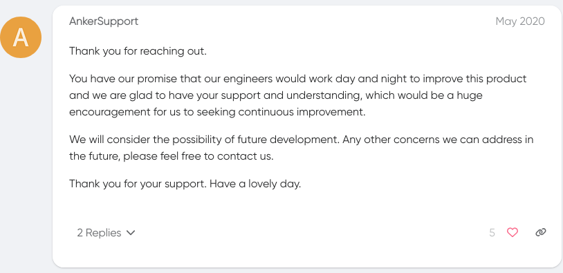

# Eufy Local Light for Home Assistant

Local control of Eufy string lights as a native Home Assistant light entity: power, brightness, and RGB over an encrypted Bluetooth Low Energy (BLE) session.

> This is an unofficial community integration built by reverse-engineering the Eufy app's BLE traffic. It is not affiliated with or endorsed by Anker/Eufy. It was developed and tested against the Eufy Outdoor String Lights E10 (model T8L10). Other lights may work but are untested.

### But first!

And i took that personally.

## Requirements

- Home Assistant :)
- Your light's Bluetooth MAC, serial number, and Eufy user ID (see [Configuration](#configuration))

## Installation

### HACS

1. In HACS, open the three-dot menu and choose Custom repositories.
2. Add `https://github.com/sudosaturn/eufy-local-ha` with category Integration.
3. Install Eufy Local Light, then restart Home Assistant.

### Manual

Copy `custom_components/eufy_local` into your Home Assistant `config/custom_components/` directory and restart.

## Configuration

Add the integration via Settings > Devices & services > Add integration > Eufy Local Light (it should also be auto discovered over Bluetooth). You will be asked for three values:

| Field | What it is | Where to find it |
| --- | --- | --- |
| Bluetooth MAC | The light's BLE address | should be auto-filled on discovery depending of what model you have but you could also use a BLE scanner like nRF Connect. |
| Serial number | 16-character device serial | On the device label and in the Eufy app device info. |
| User ID | Your Eufy account user ID (hex) | The account that paired the light. |

### Finding your User ID

- Read it from the Eufy Security account API (for example via the community [`eufy-security-ws`](https://github.com/bropat/eufy-security-ws) project), or
- Capture the app's HTTPS or BLE handshake traffic once and read the `user_id` field.

To learn more about how i reversed it and where these are used you can read [PROTOCOL.md](PROTOCOL.md).

## Options: color tuning

Raw sRGB doesnt seem to look right on these LEDs so i adjusted the saturation to to stops light colors from washing out to white (kinda).

(With that being said. i am severly colorblind so it might not actually be as accurate as it seems to me)

you can tune these from Settings > Devices & services > Eufy Local Light > Configure:

| Option | Default | Effect |
| --- | --- | --- |
| Gamma | 1.7 | Higher deepens mixed colors |
| Saturation | 1.0 | 1.0 is fully vivid; lower keeps more pastel |
| Neutral threshold | 0.12 | How close to gray before a color is treated as white |
| White balance, green | 0.85 | Lower if whites look green |
| White balance, blue | 0.55 | Lower if whites look blue; raise if amber |

### If you're having issues and disconnections make sure that you don't have the Eufy app connected! it allows one bluetooth connection at a time and you'd have to re-pair!.

If you're just here to get your lights working this probably won't be your cup of tea but feel free to see [PROTOCOL.md](PROTOCOL.md) for complete breakdown :)

License: [GPL](LICENSE)
